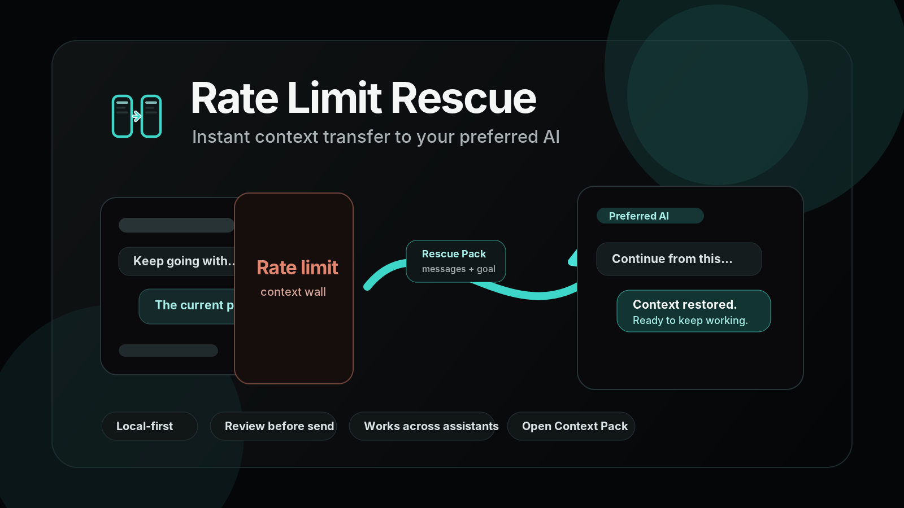

# Rate Limit Rescue



Instant context transfer to your preferred AI.

Rate Limit Rescue is a Chrome extension for the moment an AI chat stops being the right place to continue. When you hit a rate limit, context wall, model limit, or another assistant is better for the next step, Rescue captures the useful working context and transfers it to the assistant you choose.

## Why It Exists

AI work often gets stuck in one tab: the model runs out of room, a provider slows you down, or the next step belongs in a different assistant. Rate Limit Rescue keeps the work moving by turning the current state into a reviewable handoff and opening the destination assistant for you.

## What It Does

- Captures recent conversation context from supported AI assistants
- Lets you choose the next assistant before handoff
- Opens the selected assistant and pastes the rescue pack into its composer
- Optionally presses the visible send button for a one-click transfer
- Falls back to selected text or visible page context on normal web pages
- Keeps every handoff inspectable as local-first Markdown and JSON

## How It Works

1. Open an assistant conversation or a page with useful context.
2. Choose the assistant where you want to continue.
3. Press `Capture & Open`.
4. Rate Limit Rescue opens the target assistant and pastes the handoff.
5. Review and send, or enable `Send automatically` for one-click paste-and-send.

## Supported Assistants

Rate Limit Rescue currently includes first-party adapters for:

- ChatGPT
- Claude
- Gemini
- DeepSeek

It can also capture selected text and visible context from normal web pages. Any assistant that accepts pasted text can receive a copied Markdown handoff, and supported browser composers can receive direct insertion.

## Privacy And Control

- Context packs are created locally in the browser.
- Handoffs are visible as Markdown before you send them.
- Auto-send is opt-in and off by default.
- Unsupported or blocked pages fall back to copyable Markdown.
- Privacy policy: [`PRIVACY.md`](PRIVACY.md)
- Chrome Web Store privacy report: [`docs/chrome-privacy-report.md`](docs/chrome-privacy-report.md)

## Install From Source

1. Open `chrome://extensions`
2. Enable Developer mode
3. Click `Load unpacked`
4. Select this repo's `extension` folder
5. Open an AI assistant or any useful web page
6. Choose the target assistant in Rate Limit Rescue
7. Press `Capture & Open`
8. Review the pasted handoff, or enable `Send automatically` for one-click paste-and-send

## Open Context Pack

Open Context Pack `0.2` is the current portable JSON and Markdown handoff format used by Rate Limit Rescue. It records the source, target, task goal, recent messages, selected text or page context, and the continuation prompt. Legacy `0.1` packs import and upgrade to `0.2`.

Compatibility note: the protocol field remains `open-context-protocol`, and `.ocp.json` exports remain supported so existing packs keep working.

## Validate

```bash
npm run check
```

## Package

```bash
npm run package:chrome
```

The packaged Chrome zip is written to:

```text
dist/rate-limit-rescue-chrome.zip
```

## Release

- Release notes: `docs/release.md`
- Manual QA: `docs/manual-qa.md`
- Privacy policy: `PRIVACY.md`
- Chrome privacy report: `docs/chrome-privacy-report.md`
- Schema: `schema/open-context-pack.schema.json`
