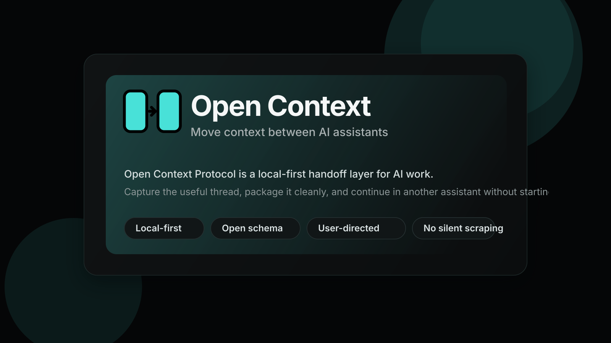

# Open Context Protocol



Open Context Protocol is a Chrome extension and open context-pack format for moving working AI context between assistants.

The first private-alpha goal is simple: when a ChatGPT session hits a limit, capture the useful context, open Claude or another assistant, and continue without starting over.

## What It Does

- Captures recent conversation context from ChatGPT, Claude, Gemini, and DeepSeek
- Falls back to selected text or visible page context on normal web pages
- Packages context as an inspectable local-first Open Context Pack
- Copies the handoff as Markdown for manual paste into any assistant
- Opens a target assistant and inserts the selected pack for review
- Keeps auto-send off by default

## Product

- Product name: `Open Context Protocol`
- Short display name: `Open Context`
- Tagline: `Move context between AI assistants`
- Canonical pack format: Open Context Pack `0.2`
- Legacy support: Open Context Pack `0.1` imports upgrade to `0.2`

## Quick Start

1. Open `chrome://extensions`
2. Enable Developer mode
3. Click `Load unpacked`
4. Select this repo's `extension` folder
5. Open ChatGPT, Claude, Gemini, or DeepSeek
6. Use the Open Context popup or right-click menu to capture a context pack
7. Open another assistant and insert the selected handoff

## Validate

```bash
npm run check
```

## Package

```bash
npm run package:chrome
```

The packaged Chrome zip is written to:

```text
dist/open-context-protocol-chrome.zip
```

## Private Alpha

- Runbook: `docs/private-alpha.md`
- Manual QA: `docs/manual-qa.md`
- Schema: `schema/open-context-pack.schema.json`

